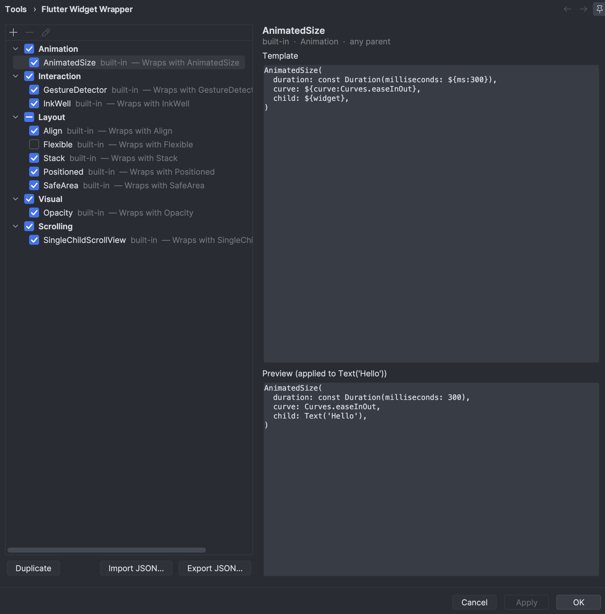

# Flutter Widget Wrapper

Flutter Widget Wrapper is an IntelliJ Platform plugin that adds context-aware
Flutter widget wrappers to the `Alt+Enter` intention menu. Wrap a widget without
manually moving code, fixing indentation, or rebuilding its constructor.


## Features

- Wrap Flutter widgets directly from the `Alt+Enter` menu.
- Includes `Align`, `AnimatedSize`, `Flexible`, `GestureDetector`, `InkWell`,
  `Opacity`, `Positioned`, `SafeArea`, `SingleChildScrollView`, and `Stack`.
- Shows context-sensitive wrappers only where they are valid. For example,
  `Flexible` is offered only for direct children of `Row`, `Column`, or `Flex`,
  and `Positioned` only for direct children of `Stack`.
- After wrapping, live-template tab-stops jump the caret to editable fields
  (`opacity`, `alignment`, …) so you can tweak values with Tab.
- Wrap several sibling widgets in a `Row`/`Column`/`Flex` `children:` list with a
  single `Stack` via `Alt+Enter`.
- Preserves indentation and reformats the generated Dart code.
- Lets you enable or disable built-in wrappers.
- Supports custom wrappers with validation, preview, and JSON import/export.
- Creates a reusable custom wrapper from an existing Flutter widget.

## Usage

1. Place the caret inside a Flutter widget in a `.dart` file.
2. Press `Alt+Enter` (`Option+Enter` on macOS).
3. Select **Wrap with _WidgetName_**.

The plugin replaces the selected widget with the chosen wrapper and runs the
IDE formatter on the resulting code. If the template defines tab-stops, the
caret lands on the first editable value; Tab cycles through the rest and ends
at `${end}` when present.


## How it works

1. **Detect** the Flutter widget under the caret (Dart PSI when available).
2. **Analyze** its parent/ancestor chain (e.g. inside a `Stack`, direct child of
   a flex).
3. **Match** which wrappers are valid for that context (`allowedParents`,
   `disallowedParents`, `requiresDirectParent`).
4. **Apply** the wrapper template: substitute `${widget}`, then either start a
   live-template session for tab-stops or reformat the range as plain text.

## Configuration

Open **Settings/Preferences | Tools | Flutter Widget Wrapper** to:

- choose which built-in wrappers appear in the intention menu;
- add, edit, duplicate, preview, or delete custom wrappers;
- import or export custom wrapper definitions as JSON.

Hover the **?** icon next to **Template** for an in-IDE summary of the template
syntax described below.



### Add a wrapper

Select **Add wrapper...** to create a custom wrapper using the visual editor.
The dialog supports templates, parent restrictions, direct-parent requirements,
categories, descriptions, and optional warning tooltips. The same **?** help
icon sits next to the template field.


## Template syntax

Every wrapper template is a list of Dart source lines (or a single multi-line
string in JSON). Markers use the `${...}` family:

| Marker | Meaning |
| --- | --- |
| `${widget}` | **Required.** Replaced with the widget under the caret (source text, indentation preserved). |
| `${name:default}` | Editable tab-stop after wrapping. Pre-filled with `default` and selected. Example: `${opacity:0.5}`. |
| `${name}` | Editable tab-stop with an empty default. |
| `${end}` | Final caret position after you Tab through all other stops. |

Reserved names: `widget` and `end`. Any other `name` becomes a tab-stop.
Marker bodies cannot contain `{` or `}` (defaults with braces are not
supported). Dart string interpolation inside the *inserted* widget is left
untouched.

### Minimal example

```dart
SafeArea(
  child: ${widget},
)
```

Wrapping `Text('Hi')` produces:

```dart
SafeArea(
  child: Text('Hi'),
)
```

### Tab-stop example

```dart
Opacity(
  opacity: ${opacity:0.5},
  child: ${widget},
)
```

After wrap, the caret selects `0.5` so you can type a new opacity and press Tab
(or Esc) to finish.

### Interaction example with final caret

```dart
GestureDetector(
  onTap: () {${end}},
  child: ${widget},
)
```

The caret ends inside the `onTap` body so you can write the handler immediately.

### Parent rules

These fields control *when* the “Wrap with …” intention appears:

| Field | Effect |
| --- | --- |
| `allowedParents` | Comma-separated parent widget names. Use `any` (default) for no restriction. |
| `disallowedParents` | Hide the wrapper when any of these parents appear in the ancestor chain. |
| `requiresDirectParent` | If true, the widget’s *immediate* parent must be one of `allowedParents` (e.g. `Flexible` under `Row`/`Column`/`Flex`). |

## Custom wrapper JSON

Every custom wrapper needs a unique `name` and a `template` containing
`${widget}`:

```json
[
  {
    "name": "Card",
    "description": "Wraps with Card",
    "category": "Visual",
    "template": [
      "Card(",
      "  child: ${widget},",
      ")"
    ]
  }
]
```

Example with tab-stops and parent rules:

```json
[
  {
    "name": "FadeOpacity",
    "description": "Opacity with a default of 0.8",
    "category": "Visual",
    "template": [
      "Opacity(",
      "  opacity: ${opacity:0.8},",
      "  child: ${widget},",
      ")"
    ],
    "allowedParents": ["any"],
    "enabled": true
  },
  {
    "name": "FlexChild",
    "description": "Flexible for Row/Column children",
    "category": "Layout",
    "template": [
      "Flexible(",
      "  flex: ${flex:1},",
      "  child: ${widget},",
      ")"
    ],
    "allowedParents": ["Row", "Column", "Flex"],
    "requiresDirectParent": true
  }
]
```

Optional fields: `enabled`, `allowedParents`, `disallowedParents`,
`requiresDirectParent`, `warning`, `description`, `category`.
Templates may be a string or an array of lines.

### Create wrapper from an existing widget

Place the caret in a widget whose content lives in `child`, `children`,
`sliver`, or `slivers`, open `Alt+Enter`, and choose
**Create wrapper from _WidgetName_**. The plugin turns that slot into
`${widget}` and opens the custom-wrapper editor.

## Installation

### From a distribution

1. Open **Settings/Preferences | Plugins**.
2. Select the gear icon and choose **Install Plugin from Disk...**.
3. Select the plugin ZIP file and restart the IDE when prompted.

The Dart plugin must be enabled for Flutter source-file integration.

### Build from source

This project uses the Gradle Wrapper:

```bash
./gradlew buildPlugin
```

The generated plugin distribution is written to `build/distributions/`.

To launch a sandbox IDE with the plugin installed:

```bash
./gradlew runIde
```

## Compatibility

- IntelliJ Platform `2026.1` or later
- Dart plugin (required; provides the PSI used for widget detection)
- IDEs that support the Dart plugin
- Flutter projects using Dart source files

## Author and publisher

Developed and published by
[Víctor Manuel Palmero Valdés](https://github.com/palmerodev).

## License

Released under the [MIT License](LICENSE).
