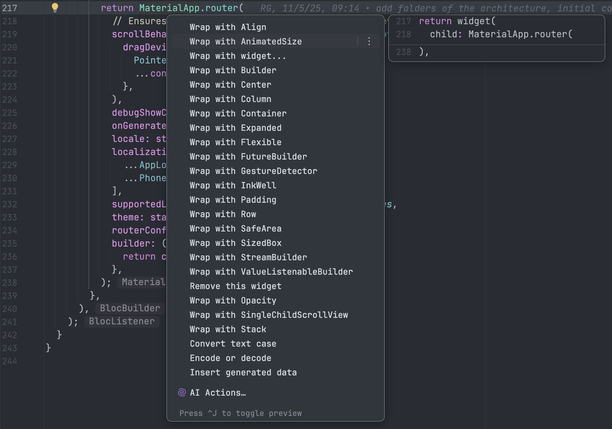
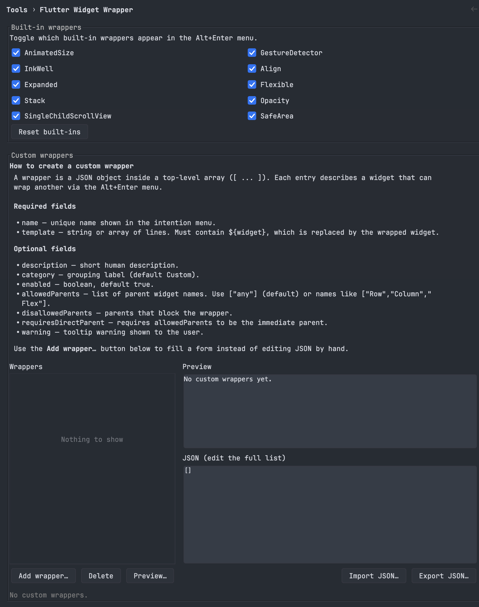
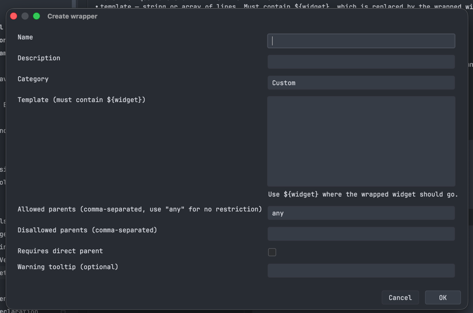

# Flutter Widget Wrapper

Flutter Widget Wrapper is an IntelliJ Platform plugin that adds context-aware
Flutter widget wrappers to the `Alt+Enter` intention menu. Wrap a widget without
manually moving code, fixing indentation, or rebuilding its constructor.


## Features

- Wrap Flutter widgets directly from the `Alt+Enter` menu.
- Includes `Align`, `AnimatedSize`, `Expanded`, `Flexible`,
  `GestureDetector`, `InkWell`, `Opacity`, `SafeArea`,
  `SingleChildScrollView`, and `Stack`.
- Shows context-sensitive wrappers only where they are valid. For example,
  `Expanded` and `Flexible` are offered only for direct children of `Row`,
  `Column`, or `Flex`.
- Preserves indentation and reformats the generated Dart code.
- Lets you enable or disable built-in wrappers.
- Supports custom wrappers with validation, preview, and JSON import/export.
- Creates a reusable custom wrapper from an existing Flutter widget.

## Usage

1. Place the caret inside a Flutter widget in a `.dart` file.
2. Press `Alt+Enter` (`Option+Enter` on macOS).
3. Select **Wrap with _WidgetName_**.

The plugin replaces the selected widget with the chosen wrapper and runs the
IDE formatter on the resulting code.



## Configuration

Open **Settings/Preferences | Tools | Flutter Widget Wrapper** to:

- choose which built-in wrappers appear in the intention menu;
- add, edit, preview, or delete custom wrappers;
- edit the complete wrapper list as JSON;
- import or export custom wrapper definitions.



### Add a wrapper

Select **Add wrapper...** to create a custom wrapper using the visual editor.
The dialog supports templates, parent restrictions, direct-parent requirements,
categories, descriptions, and optional warning tooltips.



### Custom wrapper example

Every custom wrapper needs a unique `name` and a `template` containing the
`${widget}` placeholder:

```json
[
  {
    "name": "Card",
    "description": "Wraps with Card",
    "category": "Visual",
    "template": [
      "Card(",
      "  child: ${widget},",
      ")"
    ]
  }
]
```

Optional fields include `enabled`, `allowedParents`, `disallowedParents`,
`requiresDirectParent`, and `warning`. Wrapper templates can be entered as a
string or as an array of lines.

To create a wrapper from existing Dart code, place the caret in a widget whose
content is stored in `child`, `children`, `builder`, or `itemBuilder`, open
`Alt+Enter`, and choose **Create wrapper from _WidgetName_**.

## Installation

### From a distribution

1. Open **Settings/Preferences | Plugins**.
2. Select the gear icon and choose **Install Plugin from Disk...**.
3. Select the plugin ZIP file and restart the IDE when prompted.

The Dart plugin must be enabled for Flutter source-file integration.

### Build from source

This project uses the Gradle Wrapper:

```bash
./gradlew buildPlugin
```

The generated plugin distribution is written to `build/distributions/`.

To launch a sandbox IDE with the plugin installed:

```bash
./gradlew runIde
```

## Compatibility

- IntelliJ Platform `2026.1` or later
- IDEs that support the Dart plugin
- Flutter projects using Dart source files

## Author and publisher

Developed and published by
[Víctor Manuel Palmero Valdés](https://github.com/palmerodev).

## License

Released under the [MIT License](LICENSE).
