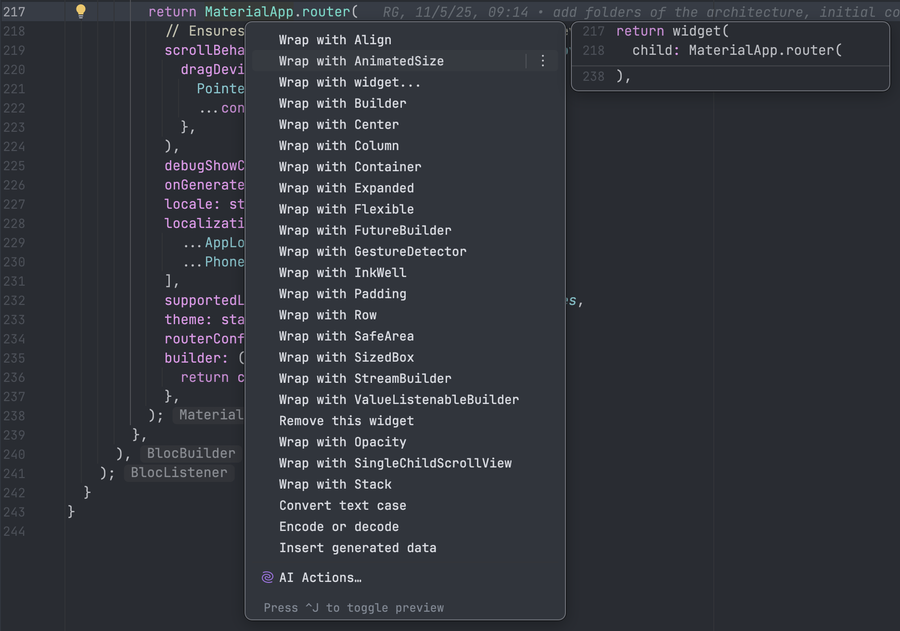
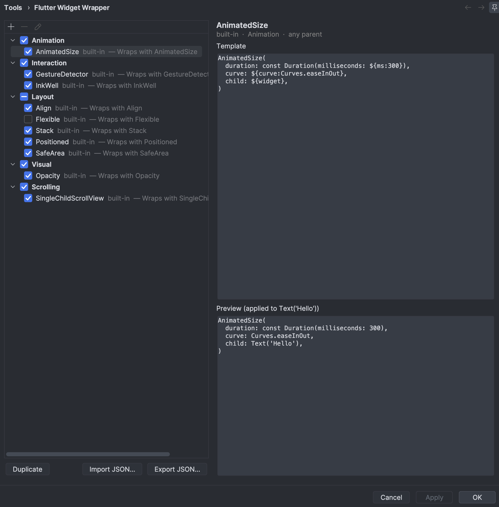
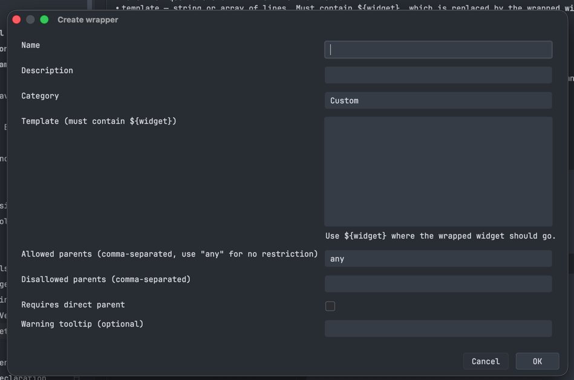

# Flutter Widget Wrapper

Flutter Widget Wrapper is an IntelliJ Platform plugin that adds context-aware
Flutter widget wrappers to the `Alt+Enter` intention menu. Wrap a widget without
manually moving code, fixing indentation, or rebuilding its constructor.


## Features

- Wrap Flutter widgets directly from the `Alt+Enter` menu.
- Includes `Align`, `AnimatedSize`, `Expanded`, `Flexible`, `GestureDetector`,
  `InkWell`, `Opacity`, `Positioned`, `SafeArea`, `SingleChildScrollView`,
  `SliverPadding`, `SliverToBoxAdapter`, and `Stack`, plus 24 optional presets
  (Consumer, BlocBuilder, ValueListenableBuilder, Hero, Visibility, ClipRRect, …).
- Shows context-sensitive wrappers only where they are valid. For example,
  `Expanded`/`Flexible` are offered only for direct children of `Row`, `Column`, or
  `Flex`, `Positioned` only for direct children of `Stack`, and inside
  `slivers:` only sliver-aware wrappers such as `SliverToBoxAdapter`.
- After wrapping, live-template tab-stops jump the caret to editable fields
  (`opacity`, `alignment`, …); fields with choices open a completion popup.
- Keeps `const` code compiling: wrapping with a closure (e.g. `GestureDetector`)
  removes the enclosing `const`.
- Several entry points: `Alt+Enter`, Surround With (`Ctrl+Alt+T` / `⌥⌘T`), postfix
  templates (`Text('a').opacity` + Tab), and an optional single **Wrap with…** popup.
- Wraps several selected siblings of a `Row`/`Column`/`Flex` `children:` list with
  any list wrapper (`Stack`, or custom ones such as `Wrap`).
- **Replace _Widget_ with…** swaps a wrapper for another one while keeping its child
  (e.g. `Flexible` → `Expanded`).
- `Alt+Enter` preview for every wrapper, and a submenu (right arrow) to edit or hide it.
- Preserves indentation and reformats the generated Dart code.
- Custom wrappers with a Dart editor, live preview, validation and JSON import/export;
  team wrappers shared through a `.flutter-wrappers.json` file in the project.
- Creates a reusable custom wrapper from an existing Flutter widget.

## Usage

1. Place the caret inside a Flutter widget in a `.dart` file.
2. Press `Alt+Enter` (`Option+Enter` on macOS).
3. Select **Wrap with _WidgetName_**.

Other ways to wrap:

- **Surround With** (`Ctrl+Alt+T` / `⌥⌘T`): select a widget, or several siblings of a
  `children:` list, and pick a wrapper.
- **Postfix templates**: type `.` plus the lower-cased wrapper name after a widget and
  press Tab, e.g. `Text('Hi').safearea`.
- **Replace**: with the caret on a widget name such as `Flexible`, choose
  **Replace Flexible with…** to swap it for another wrapper, keeping its child.
- In Settings you can group all wrappers under one **Wrap with…** entry, and offer them
  only when the caret is on the widget's constructor name.

The plugin replaces the selected widget with the chosen wrapper and runs the
IDE formatter on the resulting code. If the template defines tab-stops, the
caret lands on the first editable value; Tab cycles through the rest and ends
at `${end}` when present.



## How it works

1. **Detect** the Flutter widget under the caret (Dart PSI when available).
2. **Analyze** its parent/ancestor chain (e.g. inside a `Stack`, direct child of
   a flex).
3. **Match** which wrappers are valid for that context (`allowedParents`,
   `disallowedParents`, `requiresDirectParent`).
4. **Apply** the wrapper template: substitute `${widget}`, then either start a
   live-template session for tab-stops or reformat the range as plain text.

## Configuration

Open **Settings/Preferences | Tools | Flutter Widget Wrapper** to:

- choose which built-in wrappers appear in the intention menu, customize a built-in
  (saving an override with the same name) or reset them all;
- add, edit, duplicate, preview, or delete custom wrappers;
- add optional presets (**Add Presets…**);
- import or export custom wrapper definitions as JSON (export lets you pick which);
- group wrappers under a single **Wrap with…** entry and restrict them to the
  constructor name.

Hover the **?** icon next to **Template** for an in-IDE summary of the template
syntax described below.



### Add a wrapper

Select **Add wrapper...** to create a custom wrapper using the visual editor.
The dialog supports templates, parent restrictions, direct-parent requirements,
categories, descriptions, and optional warning tooltips. The same **?** help
icon sits next to the template field.



## Template syntax

Every wrapper template is a list of Dart source lines (or a single multi-line
string in JSON). Markers use the `${...}` family:

| Marker | Meaning |
| --- | --- |
| `${widget}` | **Required.** Replaced with the widget under the caret (source text, indentation preserved). |
| `${name:default}` | Editable tab-stop after wrapping. Pre-filled with `default` and selected. Example: `${opacity:0.5}`. |
| `${name}` | Editable tab-stop with an empty default. |
| `${name:a\|b\|c}` | Tab-stop with choices: `a` is the default and all are offered in a popup. Example: `${curve:Curves.easeIn\|Curves.linear}`. A default containing `\|\|` stays a single value. |
| `${end}` | Final caret position after you Tab through all other stops. |

Reserved names: `widget` and `end`. Any other `name` becomes a tab-stop.
Marker bodies cannot contain `{` or `}` (defaults with braces are not
supported). Dart string interpolation inside the *inserted* widget is left
untouched.

### Minimal example

```dart
SafeArea(
  child: ${widget},
)
```

Wrapping `Text('Hi')` produces:

```dart
SafeArea(
  child: Text('Hi'),
)
```

### Tab-stop example

```dart
Opacity(
  opacity: ${opacity:0.5},
  child: ${widget},
)
```

After wrap, the caret selects `0.5` so you can type a new opacity and press Tab
(or Esc) to finish.

### Interaction example with final caret

```dart
GestureDetector(
  onTap: () {${end}},
  child: ${widget},
)
```

The caret ends inside the `onTap` body so you can write the handler immediately.

### Parent rules

These fields control *when* the “Wrap with …” intention appears:

| Field | Effect |
| --- | --- |
| `allowedParents` | Comma-separated parent widget names. Use `any` (default) for no restriction. |
| `disallowedParents` | Hide the wrapper when any of these parents appear in the ancestor chain. |
| `requiresDirectParent` | If true, the widget’s *immediate* parent must be one of `allowedParents` (e.g. `Flexible` under `Row`/`Column`/`Flex`). |
| `allowedSlots` | Named arguments the widget must sit in (e.g. `["slivers", "sliver"]`). Wrappers without slots are hidden inside `sliver`/`slivers`. |
| `childKind` | `any` (default), `box` or `sliver`: what the wrapped widget must be (a sliver is any widget named `Sliver…`). |

## Custom wrapper JSON

Every custom wrapper needs a unique `name` and a `template` containing
`${widget}`:

```json
[
  {
    "name": "Card",
    "description": "Wraps with Card",
    "category": "Visual",
    "template": [
      "Card(",
      "  child: ${widget},",
      ")"
    ]
  }
]
```

Example with tab-stops and parent rules:

```json
[
  {
    "name": "FadeOpacity",
    "description": "Opacity with a default of 0.8",
    "category": "Visual",
    "template": [
      "Opacity(",
      "  opacity: ${opacity:0.8},",
      "  child: ${widget},",
      ")"
    ],
    "allowedParents": ["any"],
    "enabled": true
  },
  {
    "name": "FlexChild",
    "description": "Flexible for Row/Column children",
    "category": "Layout",
    "template": [
      "Flexible(",
      "  flex: ${flex:1},",
      "  child: ${widget},",
      ")"
    ],
    "allowedParents": ["Row", "Column", "Flex"],
    "requiresDirectParent": true
  }
]
```

Optional fields: `enabled`, `allowedParents`, `disallowedParents`,
`requiresDirectParent`, `allowedSlots`, `childKind`, `warning`, `description`,
`category`.
Templates may be a string or an array of lines.

### Team wrappers (project file)

Commit a `.flutter-wrappers.json` file (same format as above, e.g. produced by
**Export JSON…**) to the project root. Everyone who opens the project gets those
wrappers; they override built-in and personal wrappers with the same name, for that
project only. Changes to the file are picked up automatically. In `Alt+Enter`, the
**Edit** option of a project wrapper opens the file.

### Create wrapper from an existing widget

Place the caret in a widget whose content lives in `child`, `children`,
`sliver`, or `slivers`, open `Alt+Enter`, and choose
**Create wrapper from _WidgetName_**. The plugin turns that slot into
`${widget}` and opens the custom-wrapper editor.

## Installation

### From a distribution

1. Open **Settings/Preferences | Plugins**.
2. Select the gear icon and choose **Install Plugin from Disk...**.
3. Select the plugin ZIP file and restart the IDE when prompted.

The Dart plugin must be enabled for Flutter source-file integration.

### Build from source

This project uses the Gradle Wrapper:

```bash
./gradlew buildPlugin
```

The generated plugin distribution is written to `build/distributions/`.

To launch a sandbox IDE with the plugin installed:

```bash
./gradlew runIde
```

## Compatibility

- IntelliJ Platform `2026.1.5` or later
- Dart plugin (required; provides the PSI used for widget detection)
- IDEs that support the Dart plugin
- Flutter projects using Dart source files

## Author and publisher

Developed and published by
[Víctor Manuel Palmero Valdés](https://github.com/palmerodev).

## License

Released under the [MIT License](LICENSE).
